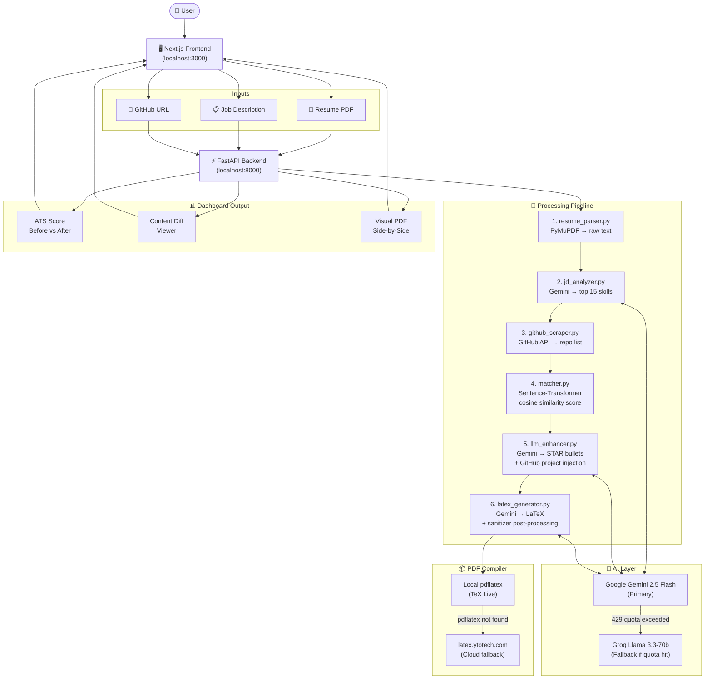

<div align="center">

# 🧠 ResumeIQ

### AI-Powered Resume Intelligence Platform

[](https://python.org)
[](https://fastapi.tiangolo.com)
[](https://nextjs.org)
[](https://ai.google.dev)
[](https://groq.com)

**Match your resume to any job description with AI, enrich it with your GitHub projects, and export a pixel-perfect LaTeX PDF — in seconds.**

[](https://youtu.be/xxe0Gb6jabM)

</div>

---

## ✨ Features

- 📄 **Resume Parsing** — Extracts raw text from your uploaded PDF using PyMuPDF
- 🔍 **JD Analysis** — Gemini 2.5 Flash extracts the top 15 hard skills from any job description
- 🐙 **GitHub Scraper** — Pulls your top repos and injects them as relevant project bullets
- 🤖 **AI Resume Enhancer** — Rewrites weak bullets using STAR methodology, aligned with the JD
- 📊 **ATS Cosine Score** — Sentence-Transformer similarity match before & after optimization
- 📝 **LaTeX Export** — Generates a compilable 1-page FAANG-style resume (LaTeX + Overleaf link)
- 🔁 **Groq Fallback** — Automatically switches to Llama 3.3-70b if Gemini quota is exhausted

---

## 🤔 Why ResumeIQ?

Most job seekers send the same generic resume to every application and wonder why they never hear back. Here's the reality:

- **ATS filters reject ~75% of resumes** before a human ever reads them — not because the candidate is unqualified, but because the resume doesn't use the right keywords from the job description.
- **Tailoring a resume manually takes hours** — reading the JD, identifying gaps, rewriting bullets, reformatting layout, re-exporting to PDF.
- **Your GitHub projects are your strongest proof of work** — but most resumes don't reflect them because mapping repos to job requirements is tedious.
- **LaTeX resumes look the most professional** — but writing and compiling LaTeX is a barrier for most people.

ResumeIQ solves all of this in one click:

| Without ResumeIQ | With ResumeIQ |
|---|---|
| Generic resume sent to every job | Resume tailored to each specific JD |
| Hours of manual rewriting | ~30 seconds of AI processing |
| GitHub projects buried or missing | Top repos auto-injected as bullet points |
| Guessing what ATS looks for | Mathematical cosine similarity score |
| Hiring a resume writer ($100–$500) | Completely free, open-source |
| Struggling with LaTeX formatting | One-click export to Overleaf / PDF |

**Who is this for?**
- 🎓 Students applying for internships and entry-level roles
- 💼 Professionals switching industries or roles
- 🌍 Anyone applying to a high volume of jobs and needing fast, tailored resumes
- 🧑‍💻 Developers who want their GitHub work to actually show up on their resume

---

## 🏗️ Project Architecture



### Codebase Structure

```
ResumeIQ/
├── backend/
│   ├── app/
│   │   ├── main.py
│   │   ├── routers/process.py        # POST /api/process/ and /compile
│   │   ├── services/
│   │   │   ├── resume_parser.py      # PDF → raw text (PyMuPDF)
│   │   │   ├── jd_analyzer.py        # Gemini JD skill extraction
│   │   │   ├── github_scraper.py     # GitHub public API scraper
│   │   │   ├── matcher.py            # Sentence-Transformer ATS scorer
│   │   │   ├── llm_enhancer.py       # Gemini bullet rewriter + Groq fallback
│   │   │   └── latex_generator.py    # LaTeX generation, sanitizer, compile proxy
│   │   └── models/schemas.py
│   ├── requirements.txt
│   └── .env.example
│
└── frontend/
    └── src/
        ├── app/page.tsx
        └── components/
            ├── UploadForm.tsx         # Resume upload + JD + GitHub input
            ├── Dashboard.tsx          # Score, diff, visual PDF tabs
            └── DiffViewer.tsx         # Before/after bullet diff renderer
```

---

## 🚀 Getting Started

### Prerequisites

- Python 3.11+
- Node.js 18+
- A [Gemini API key](https://aistudio.google.com) (free tier)
- A [Groq API key](https://console.groq.com) (free tier, used as fallback)

---

### 1. Clone the repo

```bash
git clone https://github.com/AayushTripathi07/ResumeIQ.git
cd ResumeIQ
```

### 2. Backend setup

```bash
cd backend
python -m venv .venv
source .venv/bin/activate        # Windows: .venv\Scripts\activate
pip install -r requirements.txt

# Create your .env from the example
cp .env.example .env
# Edit .env and paste your GEMINI_API_KEY and GROQ_API_KEY

uvicorn app.main:app --reload --port 8000
```

### 3. Frontend setup

```bash
cd ../frontend
npm install
npm run dev
```

Open **http://localhost:3000** in your browser.

---

## 🔑 Environment Variables

Create `backend/.env` (never commit this file):

```env
GEMINI_API_KEY=your_gemini_api_key_here
GROQ_API_KEY=your_groq_api_key_here
```

| Variable | Where to get it |
|---|---|
| `GEMINI_API_KEY` | [Google AI Studio](https://aistudio.google.com/app/apikey) |
| `GROQ_API_KEY` | [Groq Console](https://console.groq.com/keys) |

---

## 🧪 How It Works

1. **Upload** your PDF resume + paste a job description (+ optional GitHub URL)
2. **Gemini** analyzes the JD → extracts top skills
3. **GitHub scraper** fetches your public repos
4. **Sentence-Transformer** computes cosine similarity (ATS score before)
5. **Gemini** rewrites bullets using STAR method, injects GitHub projects
6. **Gemini** generates a clean 1-page LaTeX document
7. A post-processor sanitizes the LaTeX (escapes special chars, fixes brace issues)
8. The backend compiles it to PDF via local `pdflatex` or `latex.ytotech.com`
9. **Dashboard** shows: ATS score improvement, content diff, visual PDF comparison

---

## 🛠️ Tech Stack

| Layer | Technology |
|---|---|
| Frontend | Next.js 14, TypeScript, Tailwind CSS |
| Backend | FastAPI, Python 3.11 |
| AI (Primary) | Google Gemini 2.5 Flash |
| AI (Fallback) | Groq — Llama 3.3-70b Versatile |
| Resume Parsing | PyMuPDF (fitz) |
| ATS Scoring | Sentence-Transformers, scikit-learn |
| LaTeX Compilation | Local pdflatex / latex.ytotech.com |

---

## 📸 Demo

[](https://youtu.be/xxe0Gb6jabM)

---

<div align="center">

**Author: Aayush Tripathi**

[GitHub](https://github.com/AayushTripathi07) • [LinkedIn](https://linkedin.com/in/aayushtripathi07)

</div>
